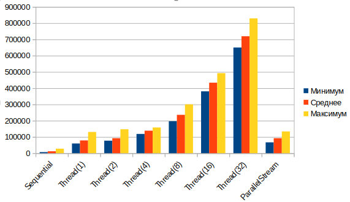
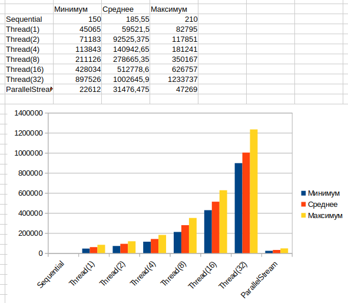
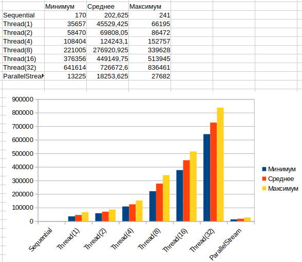
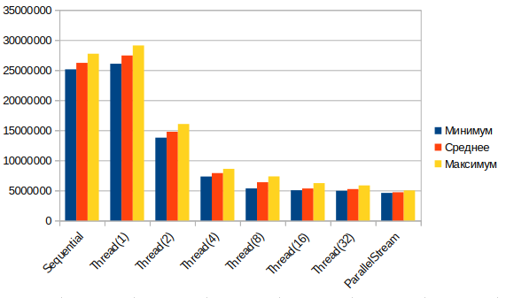

## Задача
Нужно было реализовать программу, которая проверяет массив целых чисел и возвращает true, если найдено число, не являющееся простым, и false в противном случае.

Для данной задачи было реализовано три варианта решения:
- Последовательное;
- Параллельное через потоки (Threads);
- Параллельное через ParallelStream.

## Данные
Массив чисел генерируется случайно. Для всех вариантов подаётся один и тот же массив, прогоняющийся по 100 раз для формирования средних значений. 
В программе с тестами генерируются следующие данные:

- Мало маленьких (100 чисел, медиана значений 100);
- Много маленьких (10000 чисел, медиана значений 100);
- Мало больших (100 чисел, медиана значений 10000000);
- Много больших (10000 чисел, медиана значений 10000000).

Все числа являются простыми для симуляции "наихудшего сценария".

## Результаты
На полученных столбчатых диаграммах продемонстрированы результаты работ каждого варианта решения в зависимости от набора данных. Стоит отметить, что для варианта с параллельным решением через потоки использовалось разное количество потоков (1, 2, 4, 8, 16, 32). Время работы вычислялось в наносекундах.

### Мало маленьких

### Много маленьких

### Мало больших

### Много больших

